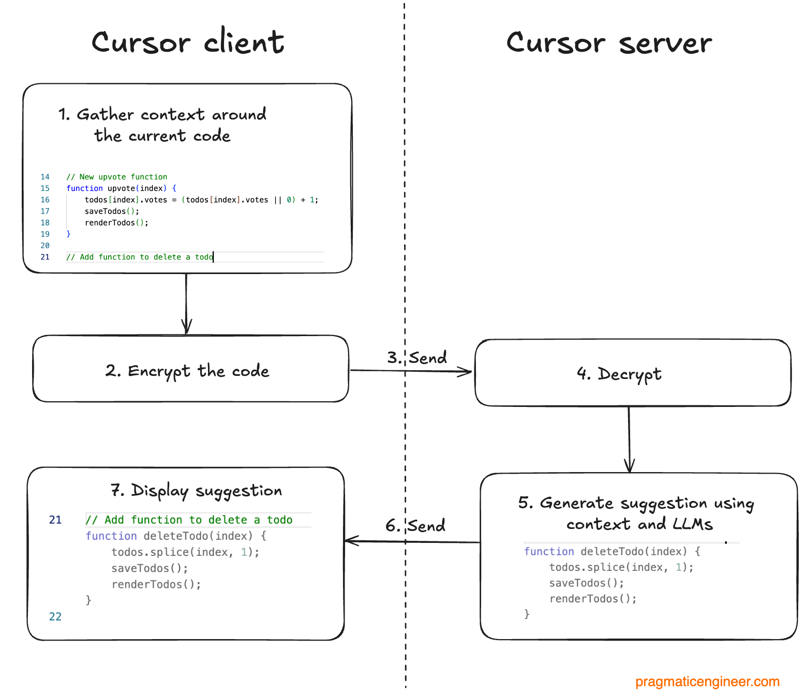

<!-- _class: title -->

# Part 1
## Core Features: Power Patterns

---

# 1.1 — Tab Autocomplete



---

# 1.1 — What Affects Completion Quality

- **Open tabs** — files in other tabs are in context
- **Recent edits** — recently changed code weighs more
- **Codebase index** — semantic patterns from the whole repo
- **File size** — very large files get truncated
- **Partial accept** — `Cmd+→` to accept one word at a time

---

# 1.1 — Exercise 1a

**Add `employmentType` to `ExperienceEntry` in `types.ts`**
**→ Tab through every ghost edit**

---

# 1.2 — `Cmd+K`

```
Select → Cmd+K → prompt → diff → accept/reject → follow-up
```

> Iterate in the same bar. Each follow-up sees the previous result.

---

# 1.2 — `Cmd+K` in the Terminal

```
Cmd+K in terminal → describe the command → approve → run
```

---

# 1.2 — Exercise 1b + 1c

**`Cmd+K` on `generateEducation()` — add fallback, then follow up**
**`Cmd+K` in terminal — generate a git log command**

---

# 1.3 — Chat Modes

`Shift+Tab` to cycle · each mode gets its own context window

---

# Agent Mode

The default. Autonomous multi-file execution loop.

```
You describe the goal → Agent reads, edits, runs, fixes, repeats
```

- Searches codebase, edits files, runs terminal commands
- Spawns sub-agents (explore, bash, browser) automatically
- Queue follow-up messages while it's working

---

# Ask Mode

Read-only. Understands code without changing it.

```
"How does the authentication flow work?"
"Explain the relationship between these two modules"
```

- Token-efficient — uses the index, not broad file reads
- **Plan with Ask, implement with Agent**

---

# Plan Mode

Creates a reviewable plan before writing any code.

```
1. Asks clarifying questions
2. Researches your codebase
3. Generates implementation plan
4. You review and edit
5. Click to build
```

- Save plans to workspace for team sharing
- If the agent builds wrong: **revert, refine the plan, re-run**

---

# Debug Mode

Runtime evidence instead of guessing at fixes.

```
1. Explore → generate hypotheses
2. Add log instrumentation → local debug server
3. Ask you to reproduce the bug
4. Analyse runtime logs → pinpoint root cause
5. Targeted fix (often just a few lines)
6. Verify → remove instrumentation
```

---

# Multitask / `/multitask`

Parallel async sub-agents from one session.

- **Queue parallelisation** — stacked prompts run concurrently
- **Auto-decomposition** — one large request split into chunks
- Each sub-agent has its own context window
- Combine with `/worktree` when sub-agents edit overlapping files

---

# 1.3 — The Decision Tree

```
Small, one-file edit?             → Cmd+K
Multiple files?                   → Agent
Need to understand first?         → Ask → Agent
Large / risky?                    → Plan → Agent
Independent parallel tasks?       → Multitask
```

---

# 1.3 — Model Selection

`Cmd+/` to cycle · model picker dropdown · persists across conversations

| Routing | What it does |
|---------|-------------|
| **Auto** | Cursor picks per-request (defaults to Composer 2) |
| **Premium** | Always the most capable model |
| **Manual** | You choose a specific model |

---

# 1.3 — Key Models

| Model | Best for |
|-------|---------|
| **Composer 2.5** | Fast iteration — the Auto default |
| **Claude Opus 4.7** | Complex architecture, security review |
| **Claude Sonnet 4.6** | Budget-conscious daily work |
| **GPT-5.5** | Alternative perspective, strong agentic coding |
| **Gemini 3 Pro** | Extreme context, multimodal |

> Switch models **mid-conversation**: fast model for exploration,
> reasoning model for implementation.

---

# Part 1 — Takeaways

1. **Tab** — next-edit prediction; `Cmd+→` for partial accept
2. **`Cmd+K`** — iterate with follow-ups; works in the terminal
3. **Modes** — Ask → Plan → Agent → Multitask is a ladder
4. **Models** — explore cheap, commit expensive

---

<!-- _class: title -->

# ☕ Break — 5 min

## Part 2 → Context & Codebase Intelligence
